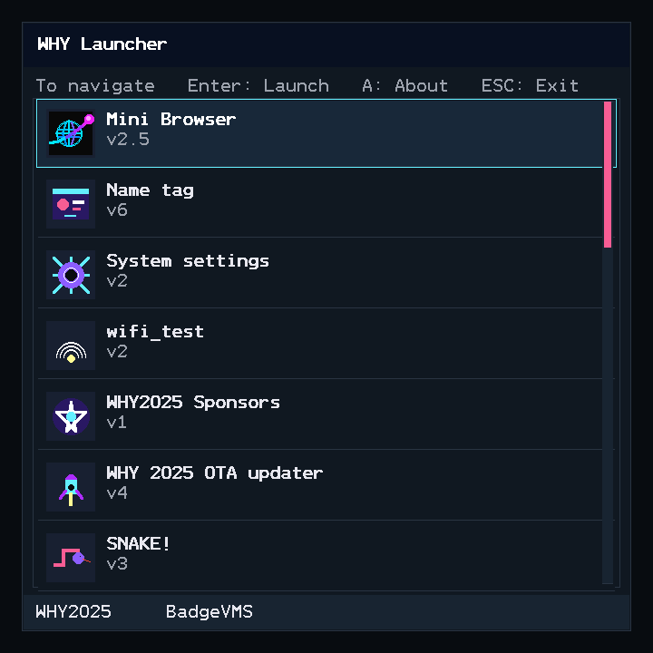

# MacTjaap WHY2025 BadgeVMS Firmware

This repository contains my customized build of **BadgeVMS** for the
ESP32-P4 based WHY2025 badge.

It is based on the original WHY2025 BadgeVMS firmware, but includes my
own launcher/UI changes, application selection and ordering, and the
latest **Mini Browser 2.5** with extended Unicode support.


## What is different in this build?

The goal of this fork is to provide a polished, useful everyday BadgeVMS
installation with a cleaner application launcher and a strong set of
preinstalled applications.

### Customized launcher and UI

The launcher has been reworked from the original BadgeVMS presentation.
Changes include:

-   A customized dark launcher/interface.
-   Custom application icons.
-   A full-screen application menu designed for the badge's 720x720
    display.
-   Improved application ordering, with frequently used applications
    placed prominently.
-   **Mini Browser** is presented as one of the primary applications.
-   Launcher/internal support applications that do not need to be
    started manually are hidden from the normal application list.
-   Updated About/information presentation and launcher navigation.



### Mini Browser 2.5

This firmware includes **Mini Browser 2.3**, my lightweight browser
designed specifically for BadgeVMS.

Mini Browser 2.5 includes:

-   HTTP and HTTPS browsing using libcurl.
-   HTML text rendering.
-   Link discovery and numbered link navigation.
-   Back and Forward history.
-   Persistent bookmarks.
-   HTML GET forms, including text, search, URL, hidden and submit
    fields.
-   UTF-8-safe text processing.
-   Pixel-aware line wrapping for mixed-width text.
-   Broad Unicode support using an external GNU Unifont-derived bitmap
    font.
-   27,696 Unicode glyphs in the generated font.
-   Japanese, Chinese, Greek, Cyrillic, punctuation, mathematical
    symbols and many other Unicode ranges.
-   Monochrome single-codepoint Plane-1 emoji.
-   Real rendered bold text for HTML `<b>` and `<strong>`.
-   Compatibility-friendly ASCII list markers when the external Unicode
    font is unavailable.
-   ..and more

The Unicode font is included in the firmware storage so a normal
build/flash of this firmware provides the extended Mini Browser
character set.

Complex color emoji, ZWJ emoji sequences, JavaScript, CSS layout and
graphical web pages are intentionally outside the scope of Mini Browser.
It is designed as a fast, text-oriented browser for the badge.

Mini Browser development is also maintained separately at:

https://github.com/mactjaap/mini_browser

## BadgeVMS

BadgeVMS is an operating environment for the WHY2025 badge.

Some of its main features are:

-   Multiple programs can run at once.
-   Every program gets its own linear address space.
-   Programs are isolated from each other, although not from the
    operating system itself.
-   VMS-style paths and search lists.
-   Applications are loaded as position-independent RISC-V ELF binaries.
-   SDL2 and SDL3 are available to applications through the BadgeVMS
    SDK.

## Supported hardware

-   WHY2025 badge (ESP32-P4 based)

## Building the firmware

This firmware is built using **ESP-IDF 5.5**.

Activate your ESP-IDF environment first. For example:

``` sh
. ~/esp-idf/export.sh
```

Then build the firmware:

``` sh
idf.py build
```

To build, flash and open the serial monitor:

``` sh
idf.py build flash monitor
```

Or specify the serial device explicitly, for example:

``` sh
idf.py -p /dev/ttyUSB0 flash monitor
```

> **Important:** this firmware has been developed and tested with the
> WHY2025 ESP32-P4 badge configuration. Do not casually regenerate the
> project configuration or run `idf.py set-target esp32p4` on an
> existing working checkout. The WHY2025 badge hardware/configuration
> must be preserved.

When pulling firmware changes that modify `sdkconfig.defaults`, a clean
rebuild may be necessary:

``` sh
idf.py fullclean
idf.py build
```


## Testing Mini Browser from macOS

This firmware includes a serial keyboard bridge that can inject keyboard
events into the normal BadgeVMS keyboard/event path. This makes it
possible to control Mini Browser from a Mac and to run repeatable browser
regression tests after firmware or application changes.

Three Python scripts are provided:

-   `badge_keyboard.py` - use the Mac keyboard interactively on the
    badge.
-   `test_minibrowser_sites_and_searches.py` - fixed Mini Browser
    regression/smoke-test suite.
-   `test_minibrowser_configurable_test.py` - configurable test runner
    for additional websites, searches and browser commands.

All three scripts communicate with the badge over the serial connection
at 115200 baud.

They require Python 3 and `pyserial`:

``` sh
python3 -m pip install pyserial
```

On macOS, check the available serial devices with:

``` sh
ls /dev/cu.*
```

The supplied scripts currently use:

``` text
/dev/cu.wchusbserial10
```

If your badge appears under another device name, change the serial
device near the top of the relevant script.

Only one program should have the serial device open at a time. Close
`idf.py monitor`, `minicom`, another serial terminal, or another test
script before starting one of these tools.

### Serial keyboard protocol

The scripts send synthetic keyboard events using a simple line-oriented
serial protocol:

``` text
E <scancode-hex> <down> <text-hex>
```

For example, pressing and releasing Enter is sent as:

``` text
E 28 1 00
E 28 0 00
```

The firmware-side keyboard driver converts these messages into normal
BadgeVMS keyboard events. From that point onward they follow the same
event path as the physical badge keyboard, through BadgeVMS and SDL3 to
Mini Browser.

The physical keyboard remains usable.

### badge_keyboard.py

`badge_keyboard.py` turns the Mac keyboard into an interactive keyboard
for the WHY2025 badge.

Run:

``` sh
./badge_keyboard.py
```

or:

``` sh
python3 badge_keyboard.py
```

Normal printable characters are translated into BadgeVMS/HID-style
keyboard scancodes. Enter, Tab, Backspace, Delete, Home, End and the
arrow keys are also supported.

The following Mac control-key combinations generate Mini Browser
WHY-key shortcuts:

| Mac key | Badge action |
| --- | --- |
| `Ctrl-E` | `WHY+E` - enter a new URL |
| `Ctrl-H` | `WHY+H` - home |
| `Ctrl-R` | `WHY+R` - reload |
| `Ctrl-B` | `WHY+B` - back |
| `Ctrl-G` | `WHY+G` - forward |
| `Ctrl-F` | `WHY+F` - add/remove bookmark |
| `Ctrl-Q` | `WHY+Q` - quit |
| `Ctrl-]` | Exit `badge_keyboard.py` |

The script also displays the badge serial/debug output while running, so
it is useful for both interactive browsing and debugging.

### test_minibrowser_sites_and_searches.py

`test_minibrowser_sites_and_searches.py` is the fixed regression suite
for Mini Browser.

It is intended to be run after firmware, SDL3, keyboard, networking or
Mini Browser changes to verify that the known working feature set still
behaves correctly.

Run:

``` sh
./test_minibrowser_sites_and_searches.py
```

or:

``` sh
python3 test_minibrowser_sites_and_searches.py
```

The script drives Mini Browser entirely through the serial keyboard
bridge. It performs browser actions in the same way a user would:
typing action numbers, pressing Enter, entering URLs and generating
WHY-key shortcuts.

The suite checks the Mini Browser home page, the recommended websites,
navigation/history operations, direct URL entry and real search forms.

The current regression tests include:

-   Loading the Mini Browser home page.
-   Wiby.
-   Marginalia Search.
-   FrogFind.
-   Hacker News.
-   NPR Text.
-   TEXTFILES.COM.
-   curl.
-   ifconfig.co.
-   Back history with `WHY+B`.
-   Forward history with `WHY+G`.
-   Reload with `WHY+R`.
-   Opening a URL with `WHY+E`.
-   Editing the current URL with `WHY+C`.
-   A real Wiby search for `esp32`.
-   A real Google search for `esp32`.
-   Returning to the Mini Browser home page with `WHY+H`.

The search tests locate the numbered form field and submit button,
enter the query, submit the GET form and inspect the resulting Mini
Browser output.

Where possible, actual search-result titles and destinations are shown
in the test summary. Google sometimes returns a compact representation
in which the result action numbers are visible but the title/URL text
is not present in the serial content. In that case the test can use a
sufficient set of numbered result actions as evidence that the search
was successfully submitted and parsed.

A complete run ends with a summary similar to:

``` text
============================================================
MINI BROWSER TEST SUMMARY
============================================================
 1. PASS       Load Mini Browser home page
 ...
15. PASS       Wiby search for esp32
16. PASS       Google search for esp32
17. PASS       Return Home with WHY+H
------------------------------------------------------------
Passed:     17/17
Not passed: 0/17
============================================================
```

A failed test is recorded as `NOT PASSED`, but the script continues
with later tests where possible.

The script exits with status `0` when all tests pass and status `1` when
one or more tests fail. This makes it useful as a repeatable post-update
regression test.

### test_minibrowser_configurable_test.py

`test_minibrowser_configurable_test.py` uses the same serial automation
framework, but its test set is controlled by the `CONFIG` dictionary
near the top of the script.

Run:

``` sh
./test_minibrowser_configurable_test.py
```

or:

``` sh
python3 test_minibrowser_configurable_test.py
```

The main configurable sections are:

-   Serial device, baud rate and timeouts.
-   Mini Browser home-page match.
-   List of websites to test.
-   List of searches to perform.
-   List of WHY-key/browser commands to test.

The serial configuration currently looks like:

``` python
"serial": {
    "device": "/dev/cu.wchusbserial10",
    "baudrate": 115200,
    "startup_delay": 2.0,
    "default_timeout": 25,
},
```

A website can be tested by entering its URL directly with `WHY+E`:

``` python
{
    "name": "Example.com",
    "mode": "url",
    "url": "example.com",
    "expect": r"HTTP 200.*https://example\.com",
},
```

or by selecting a numbered link from the Mini Browser home page:

``` python
{
    "name": "Wiby",
    "mode": "home_link",
    "action": 5,
    "expect": r"HTTP 200.*https://wiby\.me",
},
```

The supplied configurable script currently contains website tests for
Example.com, MacIP.net, Wiby, Hacker News, curl and ifconfig.co.

Search tests describe where the form is found, which query should be
entered, the submit control to use and the expected result page.

Example Wiby configuration:

``` python
{
    "name": "Wiby search",
    "source": "home_link",
    "home_action": 5,
    "open_expect": r"HTTP 200.*https://wiby\.me",
    "query": "esp32",
    "submit_label": "[search]",
    "result_expect": r"HTTP 200.*wiby\.me",
    "numbered_fallback": None,
},
```

The Google configuration also contains a `numbered_fallback` range. This
allows a valid Google search to pass when Mini Browser receives many
numbered result actions but Google does not expose enough title/URL text
for the richer result parser.

Badge/browser commands are also configured as data. For example:

``` python
{
    "name": "Reload",
    "command": "R",
    "setup": "home",
    "expect": r"HTTP 200.*https://minibrowser\.macip\.net",
},
```

The default configurable script tests:

-   `WHY+H` - Home.
-   `WHY+R` - Reload.
-   `WHY+B` - Back.
-   `WHY+G` - Forward.

The built-in setup helpers can establish a known browser state before a
command test. Current helpers include:

``` text
home
home_then_wiby
home_wiby_back
```

`WHY+Q` is deliberately not enabled in the default command list. If a
Quit test is added, place it last because it terminates Mini Browser.

The configurable runner also finishes with a `PASS` / `NOT PASSED`
summary and continues through independent tests when possible.

### Which test script should be used?

Use `test_minibrowser_sites_and_searches.py` after normal firmware or
Mini Browser updates. Its fixed test set makes regressions easy to
identify.

Use `test_minibrowser_configurable_test.py` when experimenting with new
sites, search engines, queries or WHY-key commands.

Use `badge_keyboard.py` when manually operating Mini Browser from the
Mac keyboard or when debugging an individual browser interaction.

## Firmware storage and applications

BadgeVMS uses a storage image containing the preinstalled applications
and their assets.

Mini Browser's Unicode font is installed as an application asset and is
available inside BadgeVMS as:

``` text
APPS:[mini_browser]unifont_cjk.bin
```

BadgeVMS paths are **not UNIX paths**. They use VMS-style syntax:

``` text
DEVICE:[directory.subdirectory]filename.ext
```

## Example applications

The [`sdk_apps`](sdk_apps) directory contains many BadgeVMS applications
and examples.

Some useful SDK examples include:

-   [`framebuffer_test`](sdk_apps/framebuffer_test) - direct interaction
    with the windowing system and keyboard input.
-   [`sdl_test`](sdk_apps/sdl_test) - similar functionality using SDL3.
-   [`sdl2_test`](sdk_apps/sdl2_test) - SDL2 example.
-   [`curl_test`](sdk_apps/curl_test) - HTTP(S) requests.
-   [`thread_test`](sdk_apps/thread_test) - thread creation and worker
    interaction.
-   [`doomgeneric`](sdk_apps/doomgeneric) - a complete Doom port and a
    useful reference for framebuffers, scaling, window handling and
    input.

The customized firmware also contains a broader selection of practical,
system and demonstration applications for the badge.

## Building BadgeVMS applications

BadgeVMS provides an SDK containing the BadgeVMS headers and libraries,
including SDL3 and SDL2.

Build the SDK with:

``` sh
idf.py sdk
```

This generates the `sdk_dist` directory containing the headers and
libraries.

Applications are RISC-V position-independent ELF shared objects. You can
use the `riscv32-esp-elf-*` toolchain supplied with ESP-IDF.

Example:

``` sh
riscv32-esp-elf-gcc -O2 -fPIC -fdata-sections -ffunction-sections -flto \
   -fno-builtin -fno-builtin-function -fno-jump-tables -fno-tree-switch-conversion \
   -fstrict-volatile-bitfields -fvisibility=hidden -g3 -mabi=ilp32f \
   -march=rv32imafc_zicsr_zifencei -nostartfiles -nostdlib -shared \
   -Wl,--strip-debug -Wl,--gc-sections -e main --sysroot sdk_dist -isystem sdk_dist/include \
   hello.c -o hello.elf
```

A suitable `riscv64-linux-gnu-gcc` can also be used; GCC is the tested
compiler family.

## Linking with SDK libraries

Because of limitations in the BadgeVMS ELF loader, applications should
not expose symbols other than `main`.

The standard build flags use:

``` text
-fvisibility=hidden
```

When linking an additional static `.a` library, use:

``` text
-Wl,--exclude-libs,libmylib.a
```

All dependencies not supplied by the BadgeVMS SDK must be statically
linked. BadgeVMS does not provide conventional shared-library loading or
`dlopen()`.

## Important BadgeVMS details

-   UNIX paths do not work inside BadgeVMS.
-   Paths use `DEVICE:[directory.subdirectory]filename.ext`.
-   BadgeVMS applications are position-independent ELF shared objects.
-   The RISC-V compiler and linker flags used by the SDK are important;
    ordinary executables will not load.
-   Dependencies outside the SDK must be statically linked.
-   Firmware and storage-image changes should be tested on the actual
    WHY2025 badge.

## Upstream project

This repository is a customized firmware build based on the original
WHY2025 BadgeVMS project.

Original WHY2025 firmware:

https://gitlab.com/why2025/team-badge/firmware

My customized firmware:

https://github.com/mactjaap/firmware

Mini Browser:

https://github.com/mactjaap/mini_browser

## Credits

Many thanks to the WHY2025 badge team and the BadgeVMS developers for
creating the badge firmware, operating environment, SDK and application
ecosystem.

Mini Browser and the firmware customizations in this repository are
maintained by **MacTjaap**.
